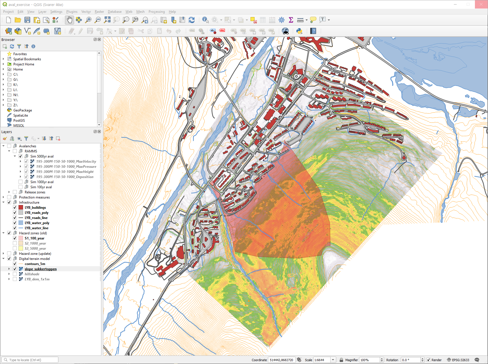

# iEarth Avalanche Assignment

Sukkertoppen is a mountain close to the town of Longyearbyen, Svalbard. The north-facing side can accumulate a substantial amount of snow during wintertime, especially with easterly and south-easterly winds. In 2015, an avalanche hit the houses closes to the slope. Two people died in this tragic event. Another, smaller, avalanche reached a few houses again in 2017. Fortunately, this time nobody was harmed. It is obvious that a more conservative hazard zoning is needed. You were asked to assess the current hazard zoning and recommend adequate protection measures for the town of Longyearbyen if necessary.

Here is a short summary of the three safety classes in the Norwegian Building code:

- S1 nominal annual return period 1/100: small buildings with no permanent person presence (garages, storages, small farming or industrial buildings)
- S2 nominal annual return period 1/1000: residential buildings with dwellings for up to 25 persons (single family houses, larger living units, camps, cottages and cabins)
- S3 nominal annual return period 1/5000: residential buildings with dwellings for over 25 persons (hotels, kindergartens, offices and large container-based living quarters at construction sites)
 

## GIS project set up
You will need a GIS to do this exercise. The setup and files were tested using QGIS 3.10.3 (Links to an external site.) and the following instructions are based on this version. If you have access to and prefer another GIS (e.g. ArcGIS) you are free to use it instead.

- First, you need to download the necessary data (Links to an external site.) and create a new GIS project. The coordinate reference system (CRS) is EPSG: 32633.
- Once downloaded you should add the elevation, contours and slope maps from the dem folder. If you want, you can use the style files for the elevation and slope maps in the styles folder. You can apply a style file to a layer by choosing Symbology - Style - Load Style.... The hillshade could also be useful when presenting your maps.
- Next you should add information on the infrastructure in and around Longyearbyen. Vector files on buildings, roads and water bodies are in the folder infrastructure.
- Finally you can add delineations of avalanche hazard zones (S1, S2 and S3) from the folder hazard_zones. There should be a style file for each zone in the folder styles.

__HINT:__ We will only work in the vicinity of the mountain Sukkertoppen. To get the right map extent, you can therefore right-click the layer slope_sukkertoppen and choose Zoom to layer.

Your project should look something like the figure below.

You are now ready to start the exercise.

## Exercises

### Task A: Introduction and setting
1) Delineate the avalanche release zone(s) on Sukkertoppen facing the town of Longyearbyen. You might find the slope map useful. You can either do this by adding polygons in GIS or open RAMMS-avalanche already now (see Task B) and add polygons there.

2) Look at the given hazard zones. Provide a table that shows how many houses are threatened by avalanches from Sukkertoppen within each hazard zone S1 to S3.

3) Get an overview of the data and write a short description of the setting. E.g. "Sukkertoppen has an elevation of.... Avalanche starting zones are situated between ... masl and ... m.a.s.l. X houses are in fall line of potential avalanches...".

### Task B: Avalanche modelling
There are three avalanche events that were modelled using [RAMMS](https://ramms.slf.ch/ramms/). These should be representative for each return period in the hazaard zoning: a smaller event representative of a 100 year event, a larger event representative of a 1000 year event and a very large event representative of a 5000 year event.

Table 1 shows details on the model setup.

|Mu/Xi name	|Return period	|Avalanche volume category	|Altitude limits 1	|Altitude limits 2|
|----|----|----|----|----|
|100S_150_50	|100 years	|small	|150 masl	|50 masl|
|300M_150_50	|300 years	|medium	|150 masl	|50 masl|

Run simulations with two different release heights for each return period. Six simulations in total. You can either use the release heights suggest in the next table or make you own (realistic) estimates. You can set/change the release height in RAMMS by right-clicking your release-shapefile and choosing Release properties. Here you also get information on mean slope and altitude and the release volume, which might be interesting to note.

|Event	|mu/xi file	|Release depth|
|---|---|---|
|100 year event A	|100S_150_50	|40 cm|
|100 year event B	|100S_150_50	|70 cm|
|1000 year event A	|300M_150_50	|120 cm|
|1000 year event B	|300M_150_50	|150 cm|
|5000 year event A	|300M_150_50	|190 cm|
|5000 year event B	|300M_150_50	|220 cm|

Each simulation provides deposition height, velocity and impact pressure as a separate layer.

### Task C: Hazard mapping and avalanche protection
1) Add the exported ASCII files to your project and describe the properties of each simulation such as maximum velocity, impact pressure and height of debris in a short paragraph or table. When using QGIS you can view the layer statistics at Properties... - Information. How much does the choice of release depth affect your model results? How would you assess the release depth?

2) Compare the simulated avalanche events to the hazard zone for the respective return period. A wooden structure such as most houses in Longyearbyen would not withstand an impact pressure of more than 10-15 kPa. Based on this knowledge and the given simulations, would you adjust the given hazard zones? If yes, draw your suggestion for different hazard zones on the map? Write a short explanation for your choice. __HINT:__ Use the style aval_pressure_categorical or set the transparency for pressures below 10 kPa to 100% so you easily see that boundary.

3) Protection measures are necessary. Estimate the height of a protection dam situated approximately where the impact pressure of your largest simulated 1000 year avalanche is around 30 kPa. Use the formula from the lecture assuming a snow depth of 1 m. __HINT:__ Consult the velocity and flow height data from your simulation.

4) Estimate the cost for building your dam. Assume a price tag of 12,000 NOK for each meter in length and height. E.g. a 10 m wide and 2 m high dam would cost 240,000 NOK.

### Task D: Report
Compile your work process and findings in a report. The report should include an introduction describing the setting and challenges. It should describe your methods and you should briefly discuss potential weaknesses, assumptions and uncertainties. Conclude with your recommendation for hazard maps and protection measures. Illustrate your work by using maps, tables and figures from exercises A-C.

Please keep in mind:

- Hand in the report as a pdf-file. The file name should include your name and the course name.
- Include page numbers
- Include figure captions (below the figure) and table captions (above the tables).
- All figures and tables in the report must be referred to in the text.
- If you show numbers in a table or in the text include units.
- Finally, upload you report to Canvas.

Good luck :-)

##Optional

The hazard maps provided in this project are outdated. You can add the prevailing hazard maps to your project using the web mapping service (WMS): http://gis3.nve.no/map/services/Skredfaresoner1/MapServer/WmsServer

Compare them to your findings.

## Feedback
Since this is the first time we assign this exercise, I would like to hear how it worked out :-) 
Did you learn something? What was easy, what was challenging? Ideas on how to improve the exercise? Let me also know approximately how many hours you spend on the assignment so that I can get an idea and can make adjustments in the future. Thank you in advance. Send your feedback to karsten.muller@geo.uio.no. (maybe set up a form). 
 

